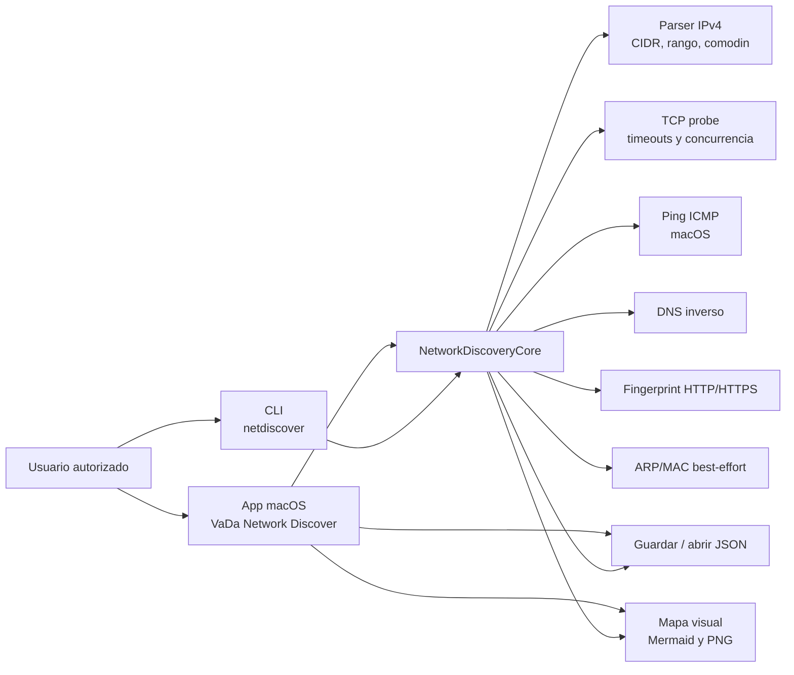
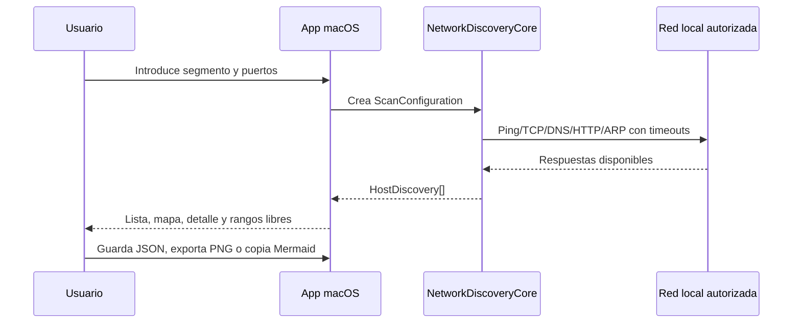
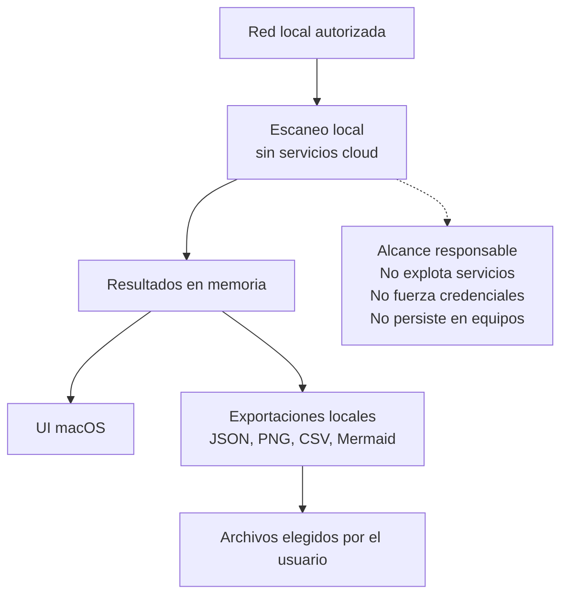

# VaDa Network Discover

[](https://github.com/itilys/vada-smart-house-network-discover-tool/actions/workflows/ci.yml)
[](LICENSE)
[](#estado)

VaDa Network Discover es una herramienta open source de VaDa SmartHouse para descubrir equipos en redes locales propias o autorizadas, visualizar puertos abiertos y generar un mapa sencillo de la arquitectura de red.

Su objetivo es exclusivamente inventariar y documentar redes locales autorizadas. No incluye explotación de vulnerabilidades, fuerza bruta, evasión, persistencia ni funcionalidades ofensivas.

## Vista General



## Estado

| Área | Estado |
| --- | --- |
| Plataforma principal | macOS 14 o superior |
| Variante inicial | iPadOS/iPad Simulator experimental |
| Lenguaje | Swift Package Manager |
| Licencia | Apache License 2.0 |
| Versión publicada | 0.1.0 |
| Bundle ID macOS | `com.vadasmarthouse.networkdiscover` |

## Funcionalidad

- Descubrimiento IPv4 por segmento CIDR, rango o comodín.
- Ping ICMP opcional en macOS.
- Escaneo TCP con timeout y concurrencia limitada.
- Catálogo de puertos comunes: SSH, HTTP, HTTPS, Modbus TCP, SMB, RTSP, MQTT, Airzone HTTP, RDP, VNC, impresoras y bases de datos.
- DNS inverso cuando está disponible.
- MAC best-effort por ARP en redes locales.
- Huellas HTTP simples mediante cabecera `Server` y título HTML.
- Clasificación heurística del tipo de equipo, con señales específicas para Fronius, Victron y Airzone cuando aparecen en huellas HTTP.
- Detección específica de VaDa SolarBrain / VaDa SolarGenius por el puerto 8090.
- Listado filtrable por texto, tipo y puerto, con ordenación.
- Mapa visual seleccionable con router marcado, zoom, pan y export Mermaid.
- Exportación del mapa a PNG con marca VaDa SmartHouse.
- Guardado/carga de escaneos en JSON.
- Refresco de escaneo conservando anotaciones, equipos estáticos y reservas DHCP.

## Flujo de Uso



## Ayuda Rapida

| Accion | Donde | Resultado |
| --- | --- | --- |
| `Escanear` | Barra lateral | Lanza un descubrimiento nuevo del segmento configurado. |
| `Refrescar` | Barra lateral | Compara el escaneo actual con la red y conserva anotaciones utiles. |
| Doble click en equipo | Lista o mapa | Abre el mejor HTTP/HTTPS detectado, si existe. |
| `Marcar router` | Detalle o menu contextual | Usa el equipo como nodo principal del mapa. |
| `Salida Internet` | Detalle o menu contextual | Marca el gateway o salida principal. |
| `Rangos libres` | Toolbar del mapa | Calcula direcciones libres y pools DHCP anotados. |
| `Exportar PNG` | Toolbar del mapa | Genera una imagen del mapa con marca VaDa SmartHouse. |
| `Copiar Mermaid` | Toolbar del mapa | Copia un diagrama Mermaid editable. |
| `Guardar` / `Abrir` | Barra lateral | Persiste o restaura el inventario en JSON local. |

## Seguridad y Privacidad



- Ejecuta la herramienta solo en redes propias o con autorización explícita.
- Los datos exportados pueden incluir IPs, hostnames, MACs, puertos abiertos, secciones y notas de inventario.
- El escaneo aplica límites de tamaño de red, timeouts y concurrencia acotada.
- La huella HTTPS acepta certificados autofirmados para poder identificar equipos locales; no se usa para validar identidad ni enviar credenciales.
- No hay backend, telemetría ni envío de resultados a terceros.

Para más detalle, revisa [SECURITY.md](SECURITY.md) y [docs/security-best-practices.md](docs/security-best-practices.md).

## Descargar la App macOS

La app empaquetada se publica como artefacto en GitHub Releases:

```text
VaDa-Network-Discover-macOS.zip
```

La build actual está firmada ad-hoc y no notarizada por Apple. En macOS, si Gatekeeper bloquea la primera apertura, usa clic derecho > Abrir, o compila localmente desde el código fuente.

## Construir en macOS

```bash
scripts/build_app_bundle.sh
open "dist/VaDa Network Discover.app"
```

También puedes instalarla en `~/Applications`:

```bash
scripts/install_macos_app.sh
open "$HOME/Applications/VaDa Network Discover.app"
```

Para desarrollo:

```bash
swift run NetworkDiscoverApp
```

## Usar Desde Consola

```bash
swift run netdiscover scan 192.168.1.0/24
swift run netdiscover scan 192.168.1.1-40 --ports 22,80,443,502 --json
swift run netdiscover scan 192.168.1.* --map
```

Opciones principales:

| Opcion | Uso |
| --- | --- |
| `--ports`, `-p` | Puertos TCP separados por coma o rangos. |
| `--timeout` | Timeout por prueba en segundos. |
| `--concurrency` | Hosts en paralelo. |
| `--no-ping` | Desactiva ping ICMP. |
| `--json` | Devuelve resultados como JSON. |
| `--map` | Devuelve un mapa Mermaid. |

## iPad Simulator

La app compila para iPad Simulator como primera base portable:

```bash
scripts/build_ipad_sim_bundle.sh
```

El bundle queda en:

```bash
dist-ios-sim/VaDa Network Discover iPad.app
```

En iPad el descubrimiento inicial usa TCP/HTTP. Ping ICMP, ARP/MAC, abrir/guardar JSON con panel nativo y la UX táctil completa quedan como trabajo específico de iPadOS.

## Verificar

```bash
swift test --disable-sandbox
scripts/build_app_bundle.sh
scripts/build_ipad_sim_bundle.sh
```

## Estructura del Proyecto

```text
Sources/
  NetworkDiscoverApp/       App SwiftUI macOS/iPadOS
  NetworkDiscoveryCore/     Parser IPv4, scanner, probes, modelos y mapas
  netdiscover/              CLI
Tests/
  NetworkDiscoveryCoreTests/
scripts/
  build_app_bundle.sh
  build_ipad_sim_bundle.sh
  install_macos_app.sh
docs/
  security-best-practices.md
```

## Contribuir

Las contribuciones son bienvenidas cuando respeten el alcance del proyecto: descubrimiento de red autorizado, documentación, mejoras de UX, compatibilidad macOS/iPadOS, rendimiento y calidad de datos. Consulta [CONTRIBUTING.md](CONTRIBUTING.md). Si trabajas con agentes de IA o automatizaciones, revisa [AGENTS.md](AGENTS.md) antes de proponer cambios.

## Licencia y Marca

El código se distribuye bajo Apache License 2.0. Consulta [LICENSE](LICENSE).

`VaDa SmartHouse`, `VaDa Network Discover`, `VaDa SolarBrain` y `VaDa SolarGenius` son nombres y marcas de VaDa SmartHouse. La licencia del código no concede permisos de marca más allá del uso razonable para describir el origen del proyecto.
